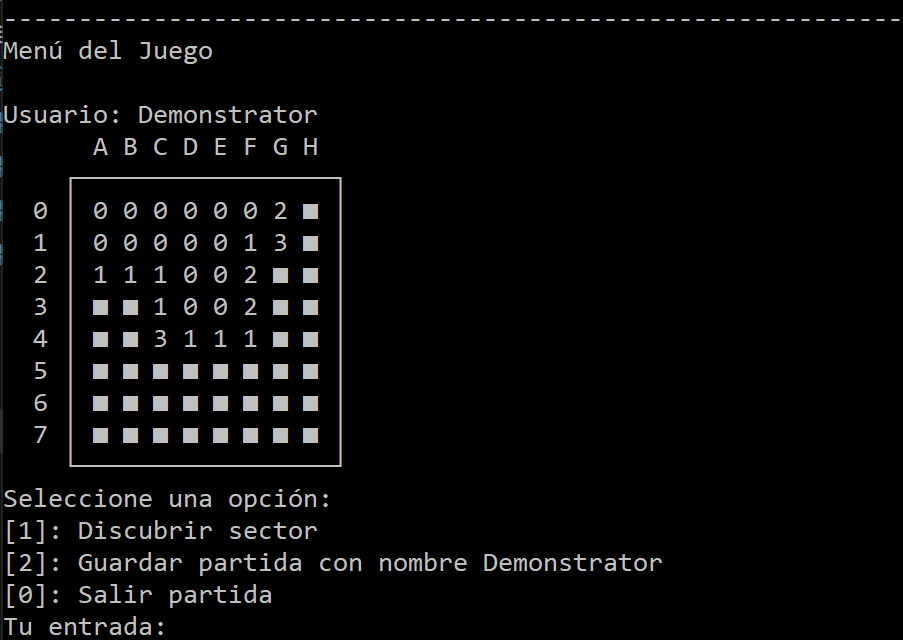
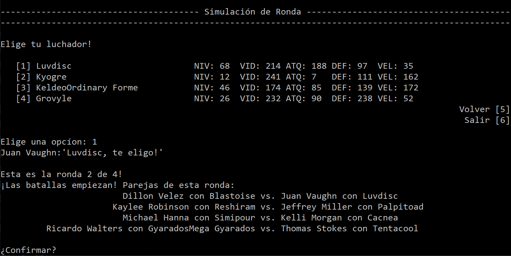
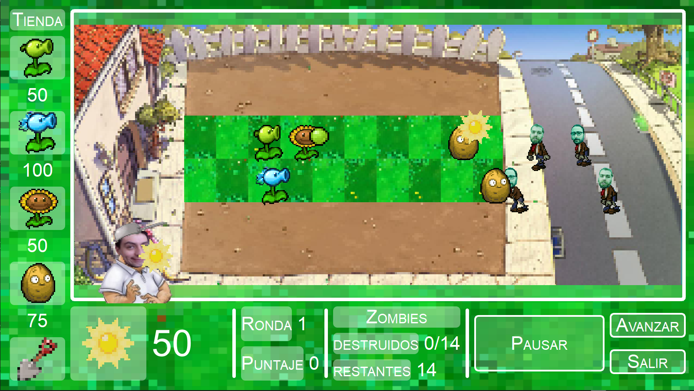
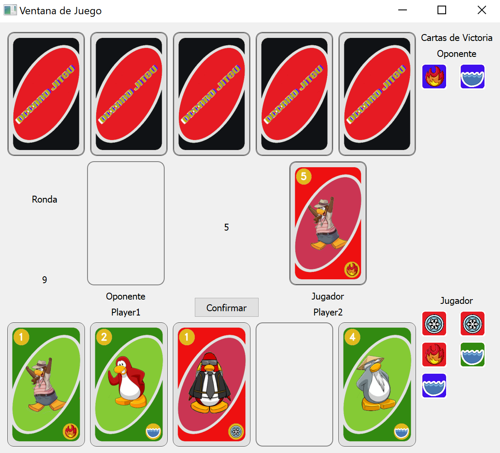

# Programación Avanzada

Assignments during the course "Programación Avanzada" (Advanced Programming) at Pontificia Universidad Católica de Chile in summer semester 2022. The course involved four major programming assignments, each of which covered central concepts of software development in Python. All projects are (slightly modified) implementations of existing games. The code has been written from scratch, following the requirements as specified in each task description. As required by the class, all games are kept in Spanish.

## Tarea 1 - Minesweeper


Console-based implementation of Minesweeper.
- handling user input
- saving and loading .csv data
- program structure and control flow

Enter folder and execute ```python StarAdvanced.py``` to play.

## Tarea 2 - Pokémon Battles


Console-based arena game, similar to Pokémon battle mechanics.
- object-oriented programming, inheritance and polymorphism
- UML class diagrams

Enter folder and execute ```python DCCampeonatoProgramon.py``` to play.

## Tarea 3 - Plants vs. Zombies


Strategic tower defense game with graphical interface.
- graphical user interfaces in PyQt5
- frontend/backend architecture
- multithreading and parallelism, timer classes
- advanced game logic

Enter folder and execute ```python main.py``` to play. Note that this game requires ```PyQt5``` to be installed, e.g. by using ```pip install pyqt5```.

## Tarea 4 - CardJitsu


Round-based multiplayer card game, using graphical interface and server-client architecture.
- server/client architecture
- graphical user interfaces in PyQt5
- exception handling

To play, you first need to start the server by running ```servidor/main.py```. Then, two independent players can log in by running ```cliente/main.py```. Note that this game requires ```PyQt5``` to be installed, e.g. by using ```pip install pyqt5```.